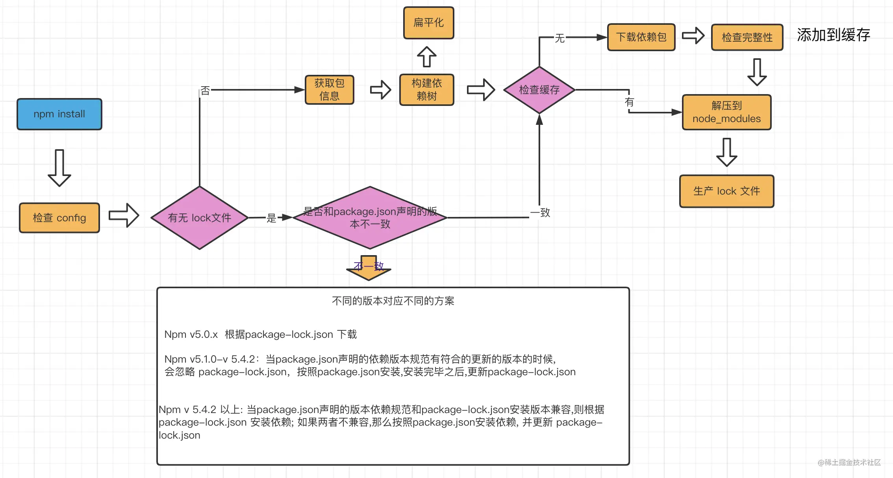

# npm i

## npm i的过程

- 检查.npmrc文件(npm配置文件，npm  config配置相关东西），优先级为：项目级的.npmrc文件 > 用户级的.npmrc文件 > 全局级的.npmrc文件 > npm内置的.npmrc文件
- 检查项目中有无lock文件
- 无lock文件：
  - 从npm远程仓库获取包信息
  - 根据package.json构建依赖树，构建过程：
    - 构建依赖树时，不管是直接依赖还是子依赖的依赖，优先将其放至在node_modules根目录
    - 当遇到相同模块时，判断已放置在node_modules根目录的模块的版本是否符合新模块的版本范围，如果符合则跳过，不符合则在当前模块的node_modules下放置该模块
    - 注意这一步只是确定逻辑上的依赖树，并非真正的安装，后面会根据这个依赖去下载或拿到缓存中的依赖包
  - 在缓存中依次查找依赖树中的每个包
    - 不存在缓存：从npm远程仓库下载包->校验包的完整性->校验不通过，则重新下载 -> 校验通过，将下载的包复制到npm缓存目录，并按照依赖结构解压到node_modules
    - 存在缓存：将缓存按照依赖结构解压到node_modules
  - 将包解压到node_modules
  - 生成lock文件
- 有lock文件
  - 检查package.json中的依赖版本是否和package-lock.json中的依赖有冲突
  - 如果没有冲突，直接跳过获取包信息、构建依赖过程，开始在缓存中查找包信息，后续过程相同

## npm install参数
- npm i X -g：安装到全局
- npm i X 或者npm i X --save：会将包安装到项目的node_modules中，同时在package.json里的dependencies属性下添加X
- npm i X --save-dev：会将包安装到项目的node_modules中，同时在package.json里的devDependencies属性下添加X。可使用npm i --production跳过devDependencies的安装